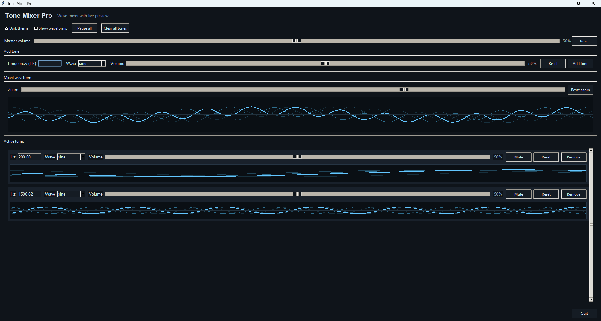

# Tone mixer pro
An app for playing and mixing tones (sine, square, sawtooth and triangle).  

### Instructions:
- Simply download "tone mixer pro v1.0.exe", save it wherever you like and run it!
- Feel free to download the python file source code and edit it.
  

*Please note this is vibe coded.*
